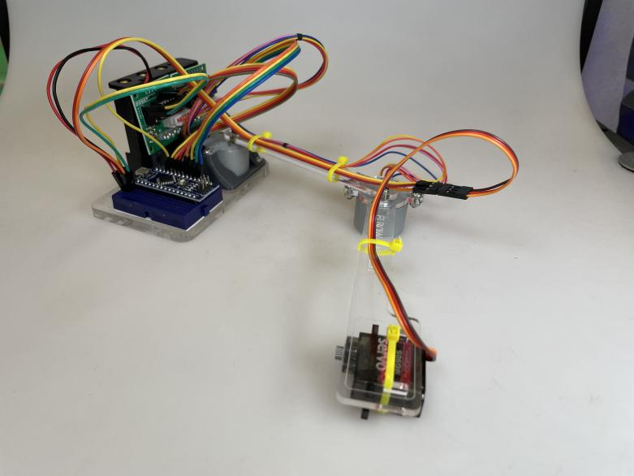

# Pen Plotter

## Presented by Mecha and Maker Club UoA

## `Introduction`

TIME: ~ 2.5hr

LINK: [https://github.com/UoA-Maker-Club/plotter-arm](https://github.com/UoA-Maker-Club/plotter-arm)

<!-- HUGH GET BETTER PIC -->

## `Format of the event`

This is a free event with the goal of sending everyone home with a pen plotter and a new set of skills. The event will be broken down into 5 parts:

**Intro**: We introduce the clubs and demonstrate briefly how to make the pen plotter and explain what we will be doing.\
**Collab**: Breaking into teams of 3-5 working together to make one pen plotter.\
**Individual**: Using the process learned in the previous step to make the rest the new lanterns for the team.\
**Food**: Needed for survival by humans.\
**Outro**: Bring the group back together and going further with the lanterns, as well as exploring more options for this tech.

## `Step 1: Code`

The first step is to download the code for this project which you can do from here:

[https://github.com/UoA-Maker-Club/plotter-arm](https://github.com/UoA-Maker-Club/plotter-arm)

click the green code button then select `Download ZIP`

you should find these instructions in the README.md file.

## `Step 2: Get Code`

This project use arduino which requires the [arduino IDE](https://www.arduino.cc/en/software#future-version-of-the-arduino-ide), but platform IO or Arduino version 1 are also supported.

## `Step 2.1: Libraries`

Click on the library icon and search for `accelstepper`, then click install. Do the same for `servo`.

## `Step 2.2: Open Code`

Open the code in Arduino, all the files are located in the folder named `pen-plotter`. You can open this by clicking `file > open` in the top left corner.

## `Step 3: Hardware`

During the in person workshop we will provide you with a few components, these are:

- 1 x [Arduino Nano](https://store.arduino.cc/products/arduino-nano)
- 2 x [28BYJ-48 Stepper Motors](https://components101.com/motors/28byj-48-stepper-motor)
- 1 x Battery Holder
- 4 x AA Batteris
- 1 x Acrylic parts (made of 3 components)
- 1 x mini bread board
- 1 x USB cable (BYO)
- 1 x Laptop (BYO)

You will need to bring 2 things

- A laptop with an internet connection and USB ports
- A data micro USB cable

### `Step 3.1: Mechanism`

Attach the breadboard, batteries, and one stepper motor to the acrylic base.

<!-- HUGH ADD PHOTO HERE -->

Connect shoulder joint and elbow join to the stepper motors

<!-- HUGH ADD PHOTO HERE -->

### `Step 3.2: Wiring`

Nano
  GND - GND batteries
        GND Sero
        GND Shoulder Stepper
        GND Elbow Stepper
        
  5V - Servo Voltage
  D2 - Servo Data
  
  D3 - Shoulder Stepper 1 
  D4 - Shoulder Stepper 2
  D5 - Shoulder Stepper 3
  D6 - Shoulder Stepper 4
  
  D7 - Elbow Stepper 1
  D8 - Elbow Stepper 2
  D9 - Elbow Stepper 3
  D10 - Elbow Stepper 4

Batteries + - Shoulder Stepper +
            - Elbow Stpper +

<!-- HUGH ADD PHOTO HERE -->

## `Step 4: Software`

Upload the code

<!-- HUGH ADD GIF HERE -->

## `Step 4: Generate Patterns`

## `Step 4.1: Website`
Use [https://sandify.org/](https://sandify.org/) to generate patterns!

Set the machine max to 300mm by 200mm
<!-- HUGH ADD GIF HERE -->

## `Step 4.2:`
Download the pattern and copy paste it into the serial monitor
<!-- HUGH ADD GIF HERE -->

## Socials

| Link      |       |  |
| --------- | -------------------------------------------------------------- | ----------------------------------------------------------------- |
| Discord   |                                                                | [penxcqxhyh](https://discord.gg/penxcqxhyh)                       |
| Instagram | [@mecha.uoa](https://www.instagram.com/mecha.uoa)              | [@make.uoa](https://www.instagram.com/make.uoa/)                  |
| Website   | [Mecha UoA](https://mechauoa.com/)                             | [makeuoa.nz](https://makeuoa.nz/)                                 |
