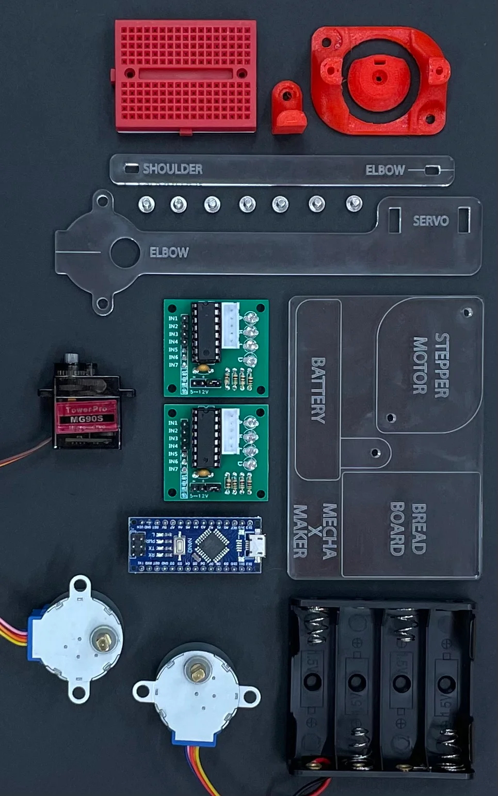
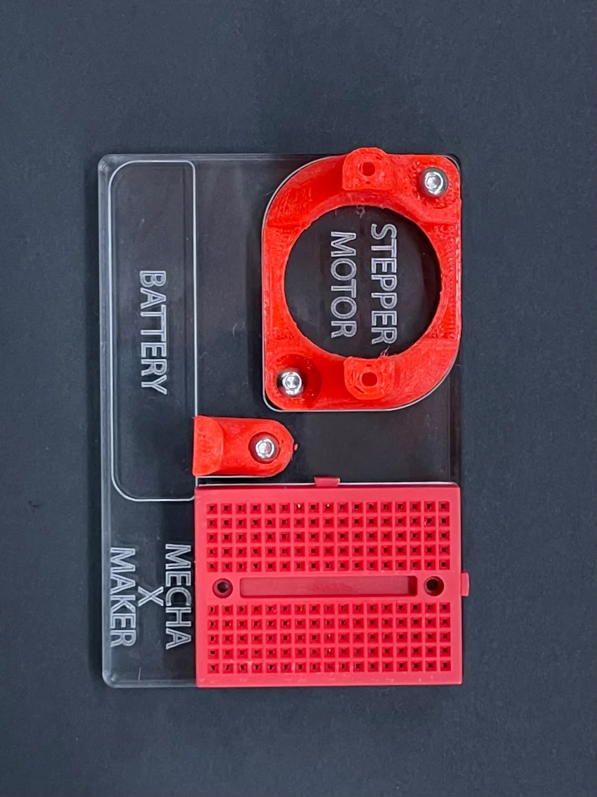
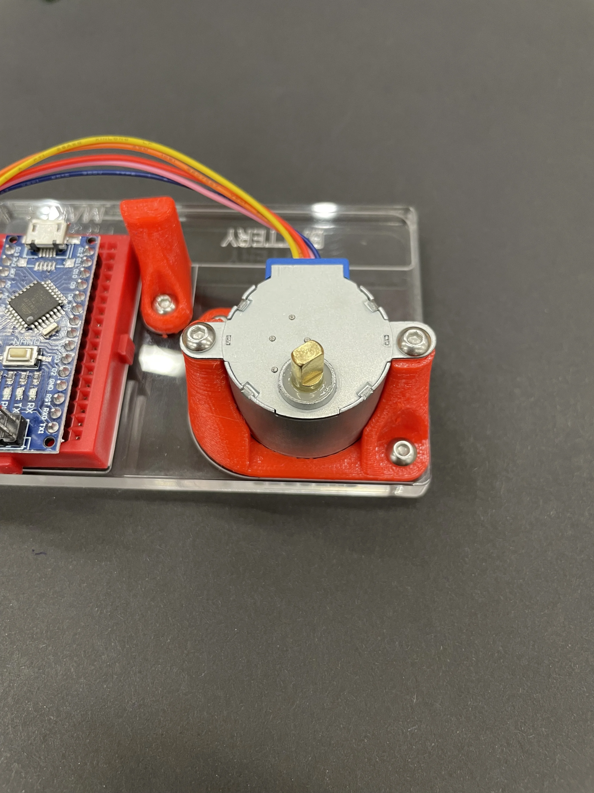
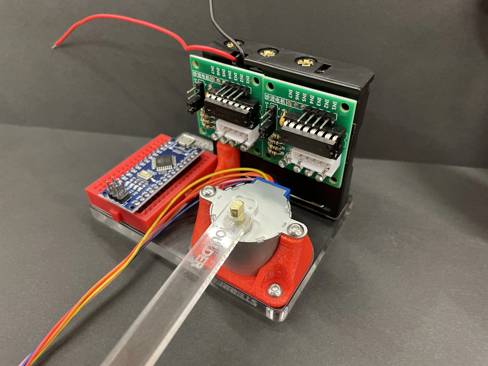
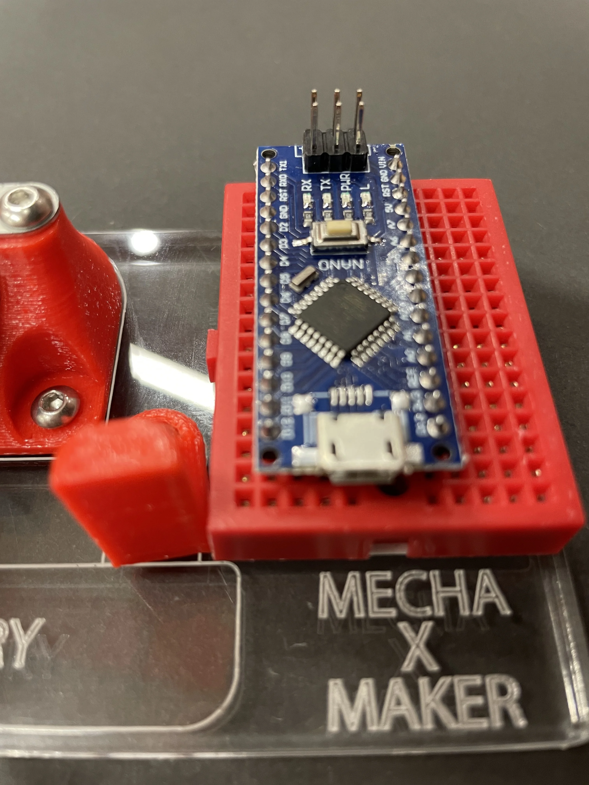
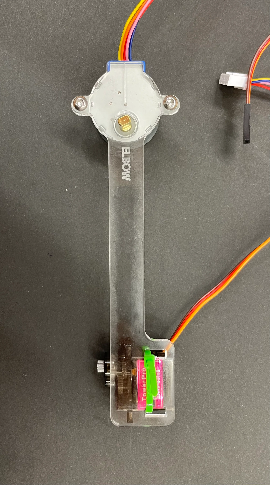
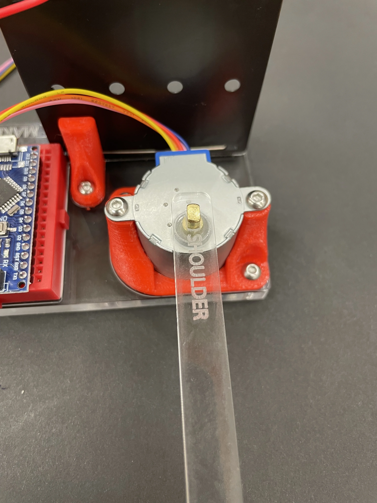
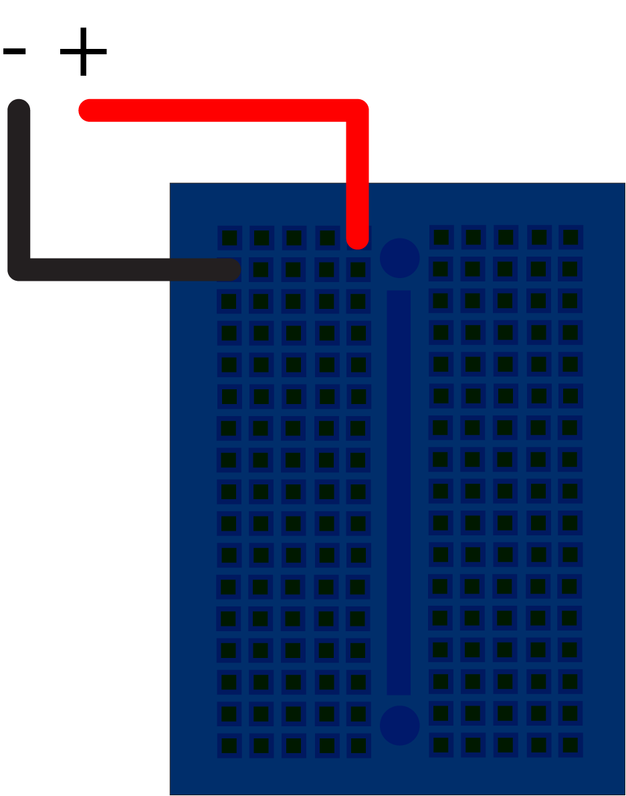

# Pen Plotter

## Presented by Mecha and Maker Club UoA

## `Introduction`

TIME: ~ 2.5hr

LINK: [https://github.com/UoA-Maker-Club/plotter-arm](https://github.com/UoA-Maker-Club/plotter-arm)

<!-- HUGH GET BETTER PIC -->

## `Format of the event`

This is a free event with the goal of sending everyone home with a pen plotter and a new set of skills. The event will be broken down into 5 parts:

**Intro**: We introduce the clubs and demonstrate briefly how to make the pen plotter and explain what we will be doing.\
**Collab**: Breaking into teams of 3-5 working together to make one pen plotter.\
**Individual**: Using the process learned in the previous step to make the rest the plotters for the team.\
**Food**: Needed for survival by humans.\
**Outro**: Bring the group back together and going further with the lanterns, as well as exploring more options for this tech.

## `Step 1: Code`

The first step is to download the code for this project which you can do from here:

[https://github.com/UoA-Maker-Club/plotter-arm](https://github.com/UoA-Maker-Club/plotter-arm)

click the green code button then select `Download ZIP`

you should find these instructions in the README.md file.

## `Step 2: Get Code`

This project use arduino which requires the [arduino IDE](https://www.arduino.cc/en/software#future-version-of-the-arduino-ide), but platform IO or Arduino version 1 are also supported.

## `Step 2.1: Libraries`

Click on the library icon and search for `accelstepper`, then click install. Do the same for `servo`.

## `Step 2.2: Open Code`

Open the code in Arduino, all the files are located in the folder named `pen-plotter`. You can open this by clicking `file > open` in the top left corner.

## `Step 3: Hardware`

During the in person workshop we will provide you with a few components, these are:

- 1 x [Arduino Nano](https://store.arduino.cc/products/arduino-nano)
- 2 x [28BYJ-48 Stepper Motors](https://components101.com/motors/28byj-48-stepper-motor)
- 1 x Battery Holder
- 4 x AA Batteris
- 3 x Acrylic parts
- 1 x mini bread board
- 3 x 3D printed parts\
- 7 x m3 bolts
- 2 x m3 nuts

You will need to bring 2 things

- A laptop with an internet connection and USB ports
- A data micro USB cable

### `Step 3.1: Mechanism`

Attach the breadboard, batteries, and one stepper motor to the acrylic base. using bolts and double sided tape

Add the stepper drivers and battery holder using double sided tape

Place the Arduino Nano into the breadboard, pay close attention to its location, it should be one row over from the stepper motor, and two columns back from the Mecha X Maker logo.

wire up the two board drivers to the arduino following the diagram

Build the forearm from the servo, stepper, and lasercut piece

Add the pen using the pen holder wheel and a zip tie

connect forearm to the base using the shoulder to elbow, acrylic piece

wire up the servo to the Arduino Nano according to the below diagram, you will need 3 extra female to male wires

the final step is to wire up the battery holder and power wires for the stepper drivers, pay careful attention to the positive and negative locations

## `Step 4: Software`

Upload the code

## `Step 4: Generate Patterns`

use the drawLine tool to try making some cool patterns

## Socials

| Link      |       |  |
| --------- | -------------------------------------------------------------- | ----------------------------------------------------------------- |
| Discord   |                                                                | [penxcqxhyh](https://discord.gg/penxcqxhyh)                       |
| Instagram | [@mecha.uoa](https://www.instagram.com/mecha.uoa)              | [@make.uoa](https://www.instagram.com/make.uoa/)                  |
| Website   | [Mecha UoA](https://mechauoa.com/)                             | [makeuoa.nz](https://makeuoa.nz/)                                 |
